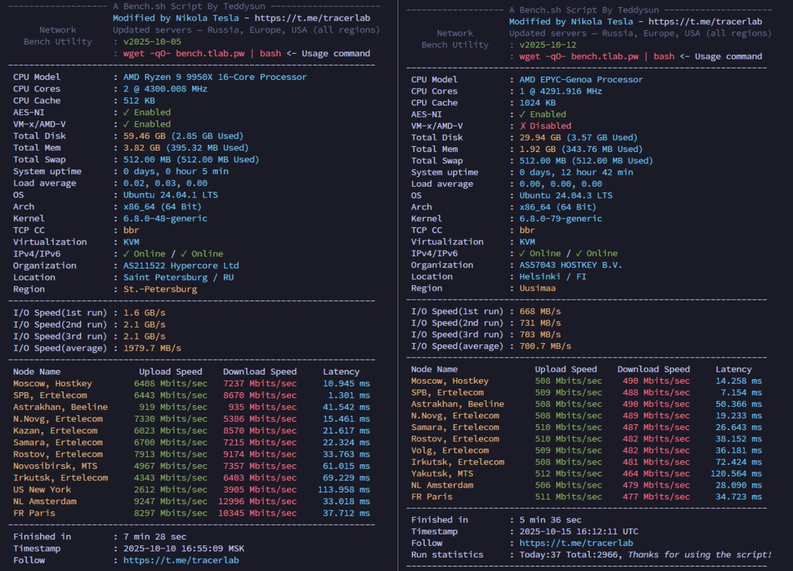

# IPerf3-Speed-Test-Script


Этот скрипт предназначен для тестирования скорости интернет-канала VPS/VDS сервера с использованием iPerf3 в многопоточном режиме, что соответствует методике Speedtest.net по нагрузке канала.

---

## ⚡ Особенности

- Используются публичные iPerf3-серверы (разные регионы и страны)
- Замеряется скорость **загрузки и отдачи одновременно** (`--bidir`)
- Проверка **пинга и доступности** перед тестом
- Автоматическая установка `iperf3`, если он не найден
- Результаты выводятся в наглядной таблице: **Upload / Download / Latency**
- Список серверов **периодически обновляется**: нерабочие удаляются, новые добавляются

---

## 📊 Почему многопоточность даёт более достоверный результат

На высокоскоростных соединениях (500 Мбит/с и выше) один TCP-поток редко способен «разогнаться» до реальной пропускной способности канала.
Это связано с ограничениями размера TCP окна (TCP window size), задержкой (RTT) и алгоритмами контроля перегрузки TCP.
Даже при низком пинге один поток может упираться в TCP slow start и другие механизмы, из-за чего результат оказывается заниженным.

**Несколько параллельных соединений** обходят эти ограничения и позволяют нагрузить канал «под завязку», что ближе к реальному сценарию, когда интернет используется сразу многими приложениями и соединениями.

---

## 👤 Автор модификации

[Nikola_Tesla]  
Основано на оригинальном `bench.sh` от Teddysun

---

## ❗ Важно

При повторном тестировании ваш IP может попасть во временный бан серверов.  
Перед повторным запуском подождите некоторое время.

---

## 🚀 Запуск

```bash
wget -qO- bench.tlab.pw | bash
